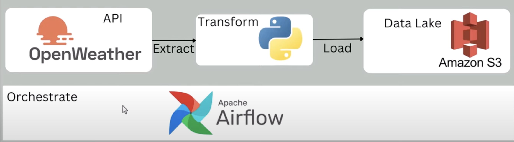

# WeatherETL-Pipeline
This project demonstrates how to build and automate an ETL (Extract, Transform, Load) pipeline using Apache Airflow to extract weather data from the OpenWeatherMap API, transform it, and load the processed data into an AWS S3 bucket. The pipeline is entirely orchestrated and automated on an AWS EC2 instance.


## Overview

This project demonstrates how to build a scalable ETL pipeline using Apache Airflow. The pipeline:
- **Extracts** weather data from the OpenWeatherMap API.
- **Transforms** the data by converting temperatures from Kelvin to Fahrenheit and extracting relevant fields.
- **Loads** the processed data into a storage solution like AWS S3 (optional integration).

## Project Architecture

The pipeline is structured as follows:
1. **HTTP Sensor**: Checks if the OpenWeatherMap API is available.
2. **HTTP Operator**: Extracts weather data from the API.
3. **Python Operator**: Transforms and processes the data.

## Technologies Used

- **Apache Airflow**: Workflow orchestration and scheduling.
- **Python**: Core programming language for data extraction and transformation.
- **OpenWeatherMap API**: API for retrieving real-time weather data.
- **AWS EC2**: Cloud environment for hosting Airflow.

## Setup and Installation

### Prerequisites

- AWS EC2 instance with Python and Airflow installed.
- Access to OpenWeatherMap API (sign up for an API key).
- Security groups and IAM roles configured for AWS services (e.g., S3 access if used).

### Installation Steps

1. **Launch EC2 Instance**:
   - Use the AWS CLI to launch your EC2 instance.
   - SSH into the instance using Visual Studio Code or another SSH client.

2. **Install Apache Airflow**:
   ```bash
   pip install apache-airflow
3. **Place the DAG
   Move the `weather_dag.py` file into the Airflow DAGs folder (e.g., `~/airflow/dags`).

4. **Configure Environment Variables
   Set up your API key and other required variables in the Airflow web UI under **Admin > Variables**.

## DAG Overview
The DAG (`weather_etl_pipeline`) consists of the following tasks:

- **Check API Availability**:  
  An `HttpSensor` checks if the OpenWeatherMap API is reachable before proceeding.

- **Extract Weather Data**:  
  A `SimpleHttpOperator` fetches weather data from the API for the specified city.

- **Transform Data**:  
  A `PythonOperator` processes and converts temperatures from Kelvin to Fahrenheit, extracting relevant fields such as humidity, pressure, and wind speed.

- **Load Data (Optional)**:  
  Data can be saved locally or uploaded to an AWS S3 bucket for further analysis.

## How to Run the Pipeline
### Start Airflow Services
    airflow webserver --port 8080
    airflow scheduler

## Access the Airflow Web Interface
Open [http://<EC2_Public_IP>:8080](http://<EC2_Public_IP>:8080) in your browser.

## Trigger the DAG
Find the `weather_etl_pipeline` and turn it on. You can manually trigger it or let it run based on its schedule.


